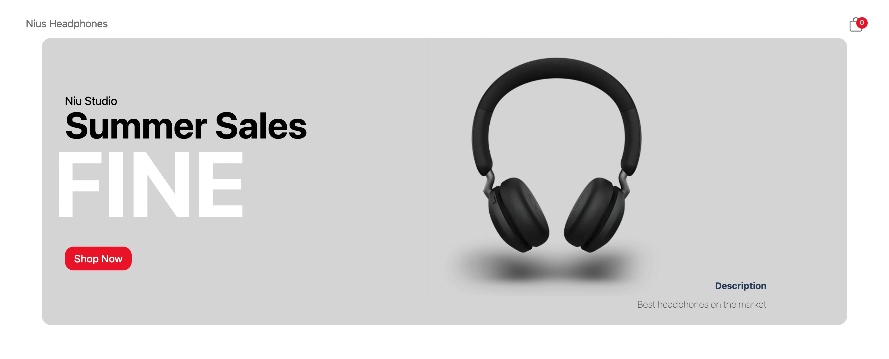
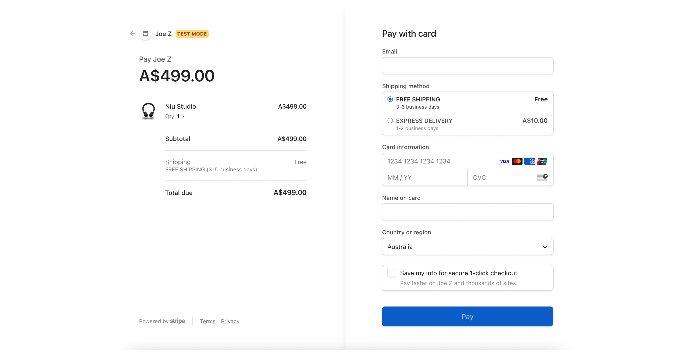
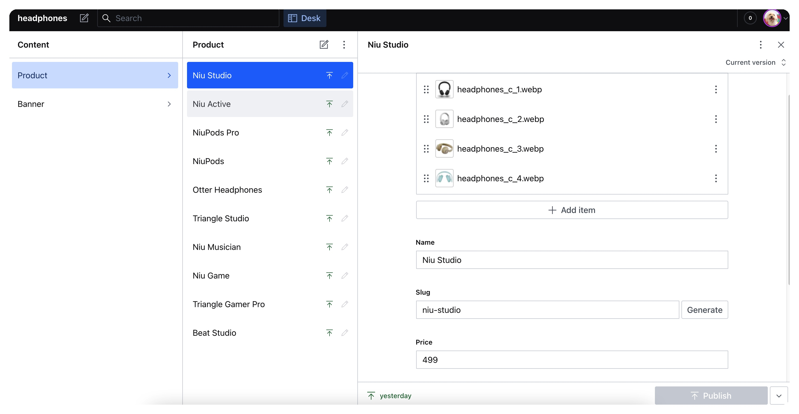

# Niu Headphones




## Introduction
[Live Demo](https://niu-headphones.vercel.app/)

Niu-Headphone is a mock E-commerce website that sells headphones.


## Technologies Used
* [Next.js](https://nextjs.org/)
* [Sanity CMS](https://www.sanity.io/)
* [Stripe](https://stripe.com/)
* [Redux Toolkit](https://redux-toolkit.js.org/)
* [Axios](https://axios-http.com/docs/intro)
* [React Hot Toast](https://react-hot-toast.com/)

## Getting Started

First, install dependencies
```bash
npm legacy-peer-deps
```

Second, run the development server:

```bash
npm run dev
```


Open [http://localhost:3000](http://localhost:3000) with your browser to see the result.

Lastly, you can edit contents at [https://niu-headphones.sanity.studio/](https://niu-headphones.sanity.studio/)